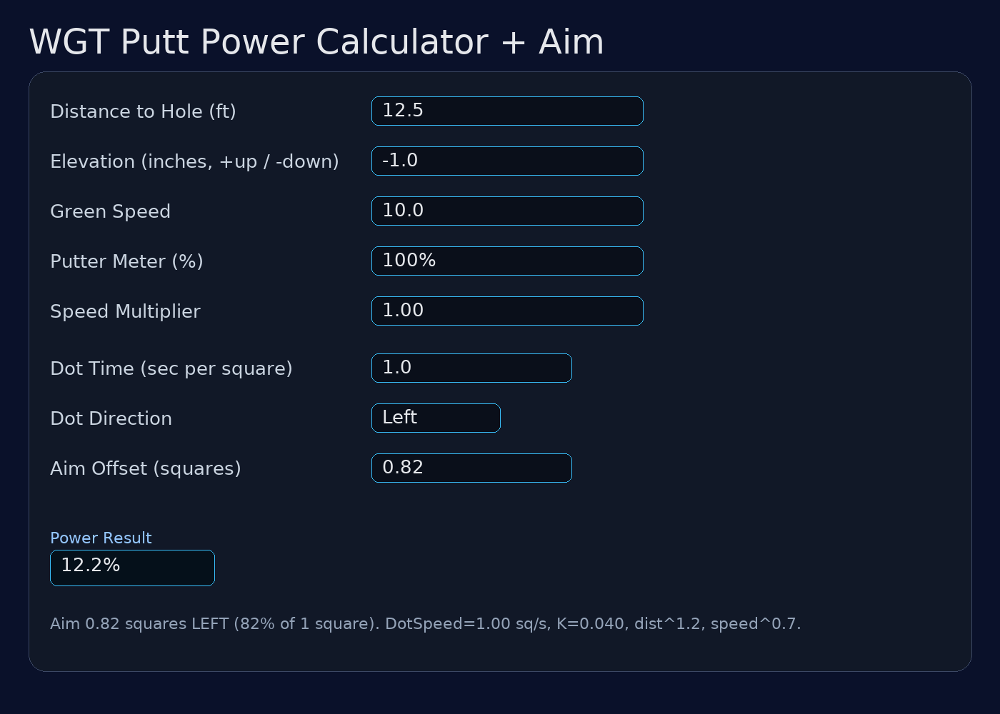

# WGT Putt Power Calculator

A simple, self-contained HTML web app for calculating **putt power in WGT Golf** based on distance, green speed, elevation, putter meter setting, and advanced tuning factors.

 <!-- optional if you add a screenshot -->

## Features

- **Distance to Hole (ft)** – Enter the total distance from ball to cup in feet.
- **Elevation (in)** – Enter elevation change in inches (**positive** for uphill, **negative** for downhill).
- **Green Speed** – Match the stimp reading in-game (e.g., `10.0` for Very Fast).
- **Putter Meter %** – Select your putter’s meter scale (100%, 75%, 50%, 25%).
- **Speed Multiplier** – Fine-tune for your ball type or personal feel.
- **Advanced Tuning**:
  - Uphill Factor (per foot)
  - Downhill Factor (per foot)
  - Snap Miss Penalty (%)
- **iOS-Friendly Controls** – Includes nudge buttons for ±0.1 changes in elevation when the iOS keypad hides the ± sign.
- **Offline Ready** – No dependencies, runs locally in your browser.
- **Local Storage** – Remembers your last settings.

## Usage

1. Open the calculator in your browser (or bookmark the GitHub Pages link).
2. Enter:
   - Distance to hole in **feet**.
   - Elevation change in **inches** (as shown in WGT Golf).
   - Green speed, putter meter %, and any tuning adjustments.
3. Click **Calculate Power**.
4. The result is shown in **% power** for your current putter meter setting.

### Example

For a 12.5 ft putt, 10.0 green speed, −1 inch downhill, and a 100% putter meter:

## Installation / Running Locally

You can run this app from any browser without a server.

**Option 1: Open Locally**
- Download `wgt_putt_power.html` from the repo.
- Double-click to open it in your browser.

**Option 2: GitHub Pages**
- Place `wgt_putt_power.html` in your repo root (or `/docs` if Pages is set to `/docs`).
- Enable GitHub Pages in **Repo Settings → Pages**.
- Access your calculator at: https://darrkloki.github.io/WGT-putt-power/

- ## Notes

- Elevation in WGT is displayed in **inches**. This app converts inches → feet internally before applying the uphill/downhill factors.
- Uphill/Downhill factors are set per foot and can be tuned in the Advanced section.
- The **Speed Multiplier** lets you match your real in-game feel for different balls or conditions.

## License

This project is provided **free for personal use**.  
No warranty is given for accuracy – always verify in-game.

---

**Author:** Sheldon Frazier  
**Last Updated:** August 2025
