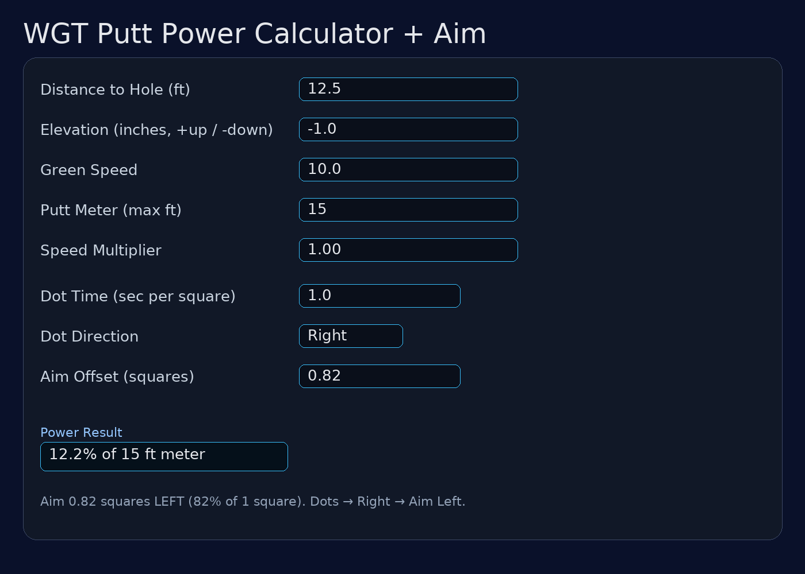

# WGT Putt Power Calculator

https://darrkloki.github.io/WGT-putt-power/

A simple, self-contained HTML web app for calculating **putt power in WGT Golf** based on distance, green speed, elevation, putter meter setting, and tunable factors.



## Features

- **Distance to Hole (ft)** – Enter the distance in feet.
- **Elevation (in)** – Enter elevation change in inches (**+** uphill, **−** downhill). Internally converted to feet.
- **Green Speed** – Match the stimp reading (e.g., `10.0` for Very Fast).
- **Putter Meter %** – Select your putter’s meter scale (100%, 75%, 50%, 25%). The output power already accounts for this.
- **Speed Multiplier** – Fine-tune for your ball or personal feel.
- **Local Storage** – Your last settings persist.

## Usage

1. Open `wgt_putt_power.html` in your browser (or via GitHub Pages).
2. Enter distance (ft), elevation (in), green speed, putter meter %, and any tuning.
3. Click **Calculate Power** to get a % power for your meter.

### Example
```
Inputs → 12.5 ft, elevation −1.0 in (−0.083 ft), speed 10.0, meter 100%
Output → 12.2%
```

## Advanced Aiming (Grid Dots)

You can optionally add **aiming** help that outputs how many grid **squares** to aim left/right, using the **moving dots** on the green.

### Inputs
- **Dot Time (sec per square)** – Time how long a dot takes to cross **one** grid square **near the hole**. Average 2–3 timings (e.g., count 3 squares with a stopwatch and divide by 3).
- **Dot Direction** – Movement **Left** or **Right** as you face the hole.

### Output
- **Aim Offset (squares)** – Positive = aim **LEFT**, Negative = aim **RIGHT**. If it’s less than 1, the app also shows the **% of one square**.

### Model (tunable)
```
dotSpeed      = 1 / dotTime_seconds              // squares per second
greenFactor   = ((greenSpeed / 10) * multiplier) ^ b
distFactor    = (effectiveDistance_ft) ^ a       // elevation-adjusted distance
elevFactor    = 1 + elev_ft * upBreakPerFt       // uphill reduces break (default negative)
             or 1 + |elev_ft| * dnBreakPerFt     // downhill increases break (default positive)
aimSquares    = K * dotSpeed * greenFactor * distFactor * elevFactor
```

**Defaults**: `K=0.040`, `a=1.20`, `b=0.70`, `upBreakPerFt=−0.30`, `dnBreakPerFt=+0.40`.  
Increase **K** if you under‑read; decrease if you over‑read. Adjust **a** slightly if long putts seem off.

### Quick Calibration (3 minutes)
1. Find a 10–12 ft breaking putt on 10.0 greens.
2. Measure **Dot Time** near the hole, set direction, calculate.
3. If your putt **misses low**, raise **K** by +0.005; **misses high**, lower K. Repeat once or twice.

**Tip:** For steadier timing, track 3 squares of travel and divide the total time by 3.

---

**Author:** Sheldon Frazier  
**Last Updated:** August 2025
